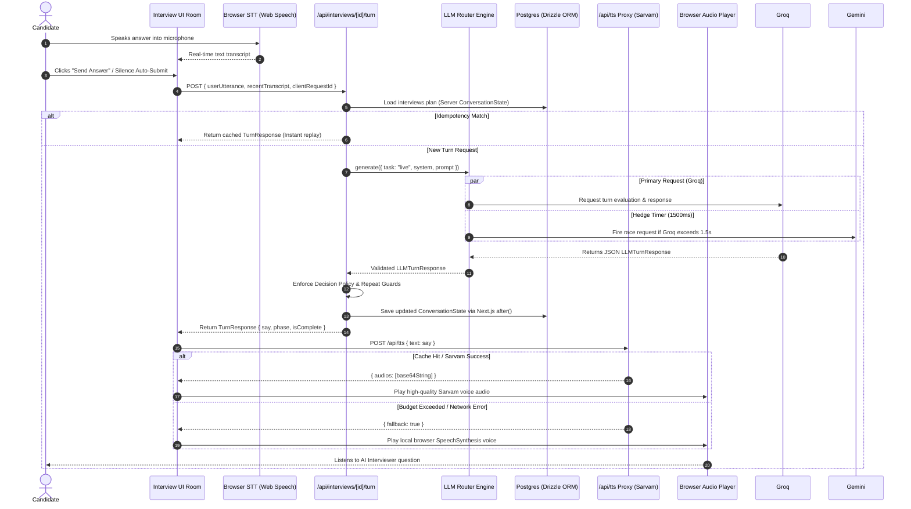
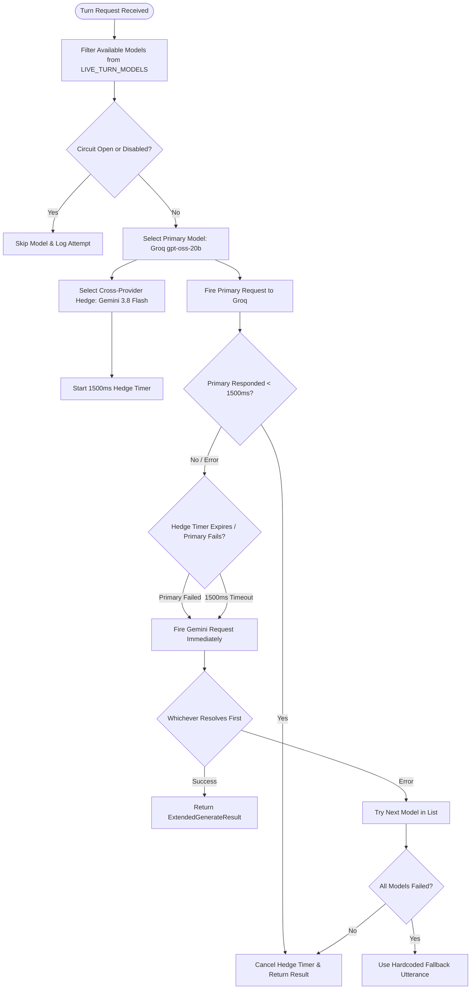
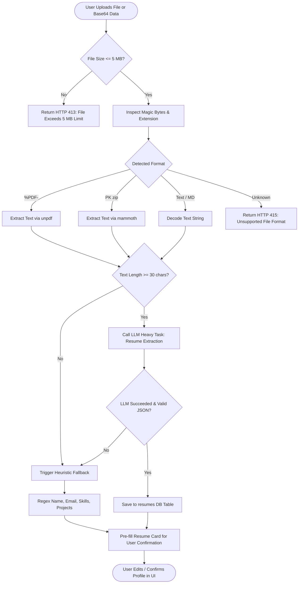
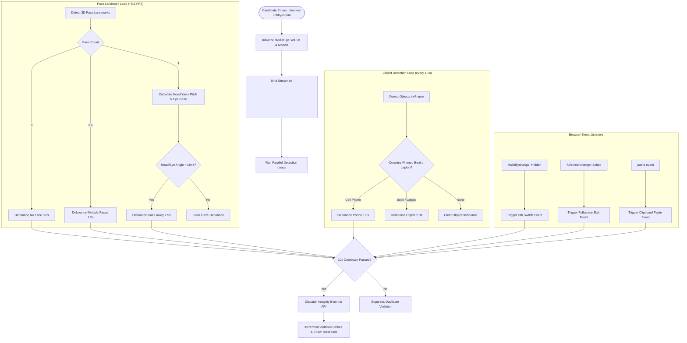

# InterviewAI — Comprehensive Technical Development & Architecture Report
*Generated on September 29, 2026*

---

## 📄 Executive Summary & Product Vision

**InterviewAI** is a production-grade, voice-enabled, AI-driven technical interview platform built with **Next.js 15 (App Router)**, **TypeScript**, **Drizzle ORM + PostgreSQL (with pgvector RAG)**, **Clerk Authentication**, **Sarvam AI (Bulbul v3 TTS)**, and **MediaPipe Vision Proctoring**.

The core mission of InterviewAI is to conduct realistic, adaptive technical interviews that evaluate candidates' technical depth, problem-solving ability, and communication skills in real time. The system acts as a transparent, objective AI hiring manager that adapts dynamically to candidate responses, enforces strict anti-cheat proctoring, and maintains an offline-tolerant, ultra-low-latency voice conversation pipeline.

---

## 🏗️ Core Technology Stack

| Layer | Technology / Library | Description & Role |
|---|---|---|
| **Framework** | Next.js 16.2.4 (App Router, Node.js runtime) | Full-stack Web application & API route orchestration |
| **Language** | TypeScript 5 (Strict Mode) | End-to-end type safety, Zod schema validation |
| **Database & ORM** | PostgreSQL + Drizzle ORM (`pgvector`) | Relational database schema with 768-dim vector embeddings |
| **Authentication** | Clerk Auth (`@clerk/nextjs`) | User authentication, identity management, session token verification |
| **LLM Router** | Multi-Provider Engine (`src/lib/llm`) | Cross-provider hedging (Groq + Gemini 3.8 Flash), circuit breakers |
| **Voice Synthesis** | Sarvam AI (`bulbul:v3` API) | Natural Indian-accented English speech generation with Web Speech fallback |
| **Speech Recognition** | Web Speech API (`webkitSpeechRecognition`) | Real-time client-side speech-to-text transcript processing |
| **Vision Proctoring** | MediaPipe Tasks Vision (`@mediapipe/tasks-vision`) | Real-time browser face landmarker (pose/gaze) & object detector (phones) |
| **Parsing Engine** | `unpdf` + `mammoth` | Magic-byte multi-format document extraction (PDF, DOCX, TXT, MD) |
| **State & Validation** | Zod 4.4 + Drizzle JSONB | Server-owned conversation state machine (`interviews.plan`) |

---

## ⚙️ Key Systems & Architectural Components

### 1. Resilient Multi-Provider LLM Engine (`src/lib/llm`)
To achieve sub-second TTFT (Time-To-First-Token) and guarantee zero runtime downtime, the system implements a custom resilient LLM router:
- **Provider & Model Registry (`src/lib/llm/config.ts`)**:
  - **Live Turn Models (Speed priority)**: `openai/gpt-oss-20b` (Groq), `gemini-3.8-flash` (Gemini), `qwen/qwen3.8-27b` (Groq), `gemini-3.5-flash-lite`.
  - **Heavy Task Models (Quality priority)**: `gemini-3.8-flash` (Gemini), `openai/gpt-oss-120b` (Groq), `gemini-3.5-flash-lite`.
  - **Embedding Model**: `gemini-embedding-001` (768 dimensions).
- **Cross-Provider Hedging (`generateWithHedging`)**:
  - For live candidate turns, the router dispatches the request to the primary provider (e.g., Groq).
  - If the primary provider does not respond within `1500 ms` (`HEDGE_FIRE_MS`), a race request is fired immediately to a *different* provider (e.g., Gemini). Whichever provider resolves first wins the race and populates the turn response.
- **In-Memory Circuit Breaker (`src/lib/llm/circuit-breaker.ts`)**:
  - Tracks consecutive failures per model/provider pair.
  - If a model fails `2 consecutive times` (`CB_FAILURE_THRESHOLD`), the circuit trips open for `5 minutes` (`CB_OPEN_MS`), skipping that model in future routing attempts to prevent cascade delays.
- **Environment Disabling & Startup Table**:
  - Outages can be simulated or providers manually disabled via `LLM_DISABLE_PROVIDERS` environment variable.
  - At app startup, a formatted status table prints configured keys and circuit statuses to stdout.

---

### 2. Server-Owned Interview Brain & State Engine (`src/lib/interview`)
The interview process is managed entirely by a server-side state machine stored inside the database column `interviews.plan` (JSONB):
- **5-Phase Progression**: `intro` → `warmup` → `core` → `wrapup` → `closing`.
- **Dynamic Topic Generation (`generateCoverageTopics`)**:
  - Upon interview startup, a heavy LLM task generates 4–8 customized coverage topics tailored to the candidate's resume and target job role.
- **Intent-Driven Classification**:
  - Every candidate utterance is classified into exact intents: `answer`, `partial`, `repeat_request`, `meta`, `question_to_ai`, `smalltalk`, `offtopic`, `unprofessional`, `garbled`, or `stop`.
- **Numerical Scoring Policy**:
  - **Strict rule**: Only substantial responses (`answer` or `partial`) are scored (0–10). Meta comments, greetings, or clarifications receive `score: null` and never dilute the candidate's technical score.
- **Anti-Repetition & Policy Guards**:
  - **Clarification Ladder**: Uses a 3-step progressive clarification prompt when candidate input is garbled/unclear, ending with a text-box fallback suggestion.
  - **Similarity Check (`isTooSimilar`)**: Jaccard token overlap guard prevents asking questions similar to any of the last 8 turns (threshold `0.50`).
  - **Phrase-Level Repeat Guard (`isPhraseRepeated`)**: Checks 3-word openers against `spokenReplies` to prevent repeated AI conversational filler.
  - **Professionalism Nudge**: 1st unprofessional utterance gets a polite boundary statement; 2nd+ receives a quiet redirect without commentary.

---

### 3. High-Frequency Hot Path Turn Route (`src/app/api/interviews/[id]/turn/route.ts`)
The core conversational turn route is optimized for high-throughput, low-latency execution:
- **Idempotency & Replay Protection**: `clientRequestId` (hashed utterance + turn index) prevents double-processing on network retries. Replayed requests return cached JSON payloads instantly.
- **Single Structured LLM Call**: Replaces separate prompt steps with a unified LLM prompt that simultaneously performs *Intent Classification*, *Technical Evaluation*, *Action Selection*, and *Spoken Response Generation*.
- **Async DB Persistence (`after()`)**: Database updates (updating turn counts, saving `interviews.plan`, appending transcript chunks) are offloaded to Next.js `after()` background callbacks, returning HTTP 200 to the client in `< 500ms`.

---

### 4. Robust Multi-Format Resume Parser (`src/app/api/parse-resume/route.ts`)
Allows candidates to upload existing resumes or confirm AI-parsed profiles:
- **Multi-Format Extraction**:
  - `unpdf` for vector PDF text extraction.
  - `mammoth` for DOCX document parsing.
  - Native text decoding for TXT/MD files.
- **Magic-Byte Format Verification**: Validates file binary headers (`%PDF-`, `PK\x03\x04` for Zip/DOCX) rather than trusting untrusted file extensions.
- **File Safety & Limits**: Strictly enforces a 5 MB upload ceiling with structured JSON error responses (HTTP 413 / 415 / 422).
- **Heuristic Fallback Engine (`heuristicParse`)**: If LLM parsing quotas fail or text is unreadable, a regex-based heuristic extractor extracts candidate names, emails, years of experience, and tech stack keywords—ensuring candidates are never blocked from entering the lobby.

---

### 5. Enhanced Text-to-Speech (TTS) Proxy (`src/app/api/tts/route.ts`)
High-quality voice output powered by **Sarvam AI (Bulbul v3)**:
- **Text Preprocessing & Sanitization (`stripForTTS`)**: Automatically strips Markdown formatting, code fences, URLs, emojis, and bullet points before sending text to speech synthesis.
- **SHA-256 Content-Addressed Cache**: In-memory LRU cache keyed by `sha256(speaker:cleanText)` caches generated audio base64 buffers for instant repeat playback.
- **Budget Protection**:
  - Enforces per-user daily limits (`5,000 chars/day`) and global daily caps (`200,000 chars/day`) with UTC midnight resets.
- **Browser SpeechSynthesis Fallback**: Returns a `{ fallback: true }` signal if quotas are exceeded or Sarvam API is unreachable, causing the browser UI to seamlessly fall back to local Web Speech API synthesis.

---

### 6. Browser-Based Real-Time Vision Anti-Cheat (`src/lib/integrity`)
Client-side proctoring engine running inside the candidate's browser via MediaPipe WebAssembly:
- **FaceLandmarker Monitoring**:
  - Calculates real-time 3D head **Yaw** and **Pitch** pose angles.
  - Evaluates eye blendshapes (`eyeLookOut`, `eyeLookIn`, `eyeLookUp`) to detect sustained gaze aversion.
  - Detects `no_face` (candidate left frame) or `multiple_faces` (unauthorized secondary person).
- **ObjectDetector Monitoring**:
  - Detects physical anti-cheat items (`cell phone`, `book`, `laptop`).
- **Browser Event Interception**:
  - Captures `visibilitychange` (tab switching), `fullscreenchange` (exiting fullscreen), and `paste` events.
- **Debouncing & Cooldowns**:
  - Violations must persist for specific durations (e.g., 2.5s for gaze away, 3.0s for missing face) before triggering a violation strike.
  - 10-second cooldown per event type prevents violation notification spamming.

---

## 🗄️ Database Architecture (`src/db/schema.ts`)

```
   ┌────────────────────────────────────────────────────────┐
   │                        resumes                         │
   ├────────────────────────────────────────────────────────┤
   │ id: uuid (PK)                                          │
   │ user_id: text (Indexed)                                │
   │ full_name: text                                        │
   │ raw_text: text                                         │
   │ structured_data: jsonb (ExtractedResume schema)       │
   │ created_at: timestamp                                  │
   └───────────────────────────┬────────────────────────────┘
                               │ 1 : N (onDelete: set null)
                               ▼
   ┌────────────────────────────────────────────────────────┐
   │                       interviews                       │
   ├────────────────────────────────────────────────────────┤
   │ id: uuid (PK)                                          │
   │ user_id: text                                          │
   │ resume_id: uuid (FK -> resumes.id)                      │
   │ job_role: text                                         │
   │ job_description: text                                  │
   │ status: enum ('ongoing', 'completed', 'failed')       │
   │ current_phase: enum ('greeting','rapport','technical'..)│
   │ score: integer                                         │
   │ feedback: jsonb (Overall Feedback & Summary)           │
   │ gemini_calls_count: integer                            │
   │ total_turns: integer                                   │
   │ adaptive_decisions_count: integer                      │
   │ plan: jsonb (Server ConversationState Brain Object)    │
   │ created_at: timestamp                                  │
   └───────────────────────────┬────────────────────────────┘
                               │ 1 : N (onDelete: cascade)
                               ▼
   ┌────────────────────────────────────────────────────────┐
   │                   transcript_chunks                    │
   ├────────────────────────────────────────────────────────┤
   │ id: uuid (PK)                                          │
   │ interview_id: uuid (FK -> interviews.id, Indexed)      │
   │ content: text                                          │
   │ speaker: enum ('user', 'ai')                           │
   │ embedding: vector(768) (pgvector index)                │
   │ created_at: timestamp                                  │
   └────────────────────────────────────────────────────────┘
```

---

## 🌐 API Routes Reference

| Route Path | Method | Access | Description |
|---|---|---|---|
| `/api/parse-resume` | `POST` | Authenticated | Multi-format resume extraction (PDF, DOCX, TXT) with heuristic fallback. |
| `/api/interviews/initialize` | `POST` | Authenticated | Creates new interview record & generates 6 coverage topics. |
| `/api/interviews/[id]/turn` | `POST` | Authenticated | Main turn hot-path route: evaluate candidate answer + decide action + speak. |
| `/api/interviews/[id]/feedback` | `GET/POST` | Authenticated | Generates comprehensive candidate report card, topic scores, and strengths/gaps. |
| `/api/interviews/[id]/integrity` | `POST` | Authenticated | Logs proctoring violations and manages candidate strike counters. |
| `/api/tts` | `POST` | Authenticated | Sarvam Bulbul v3 proxy with SHA-256 caching & budget control. |
| `/api/dev/test-llm` | `GET` | Dev Mode | Utility endpoint to inspect LLM provider health & model table status. |

---

## 📐 Full Architecture & Flow Diagrams

### Diagram 1: High-Level System Architecture

```mermaid
flowchart TB
    subgraph Client["Browser Client (React 19 / Next.js Client Components)"]
        UI["Interview Room UI UI ([id]/page.tsx)"]
        STT["Web Speech API (STT Input)"]
        MediaPipe["MediaPipe Vision Engine (Face/Pose/Object)"]
        TTSClient["Audio Queue Player (Sarvam / WebSpeech Fallback)"]
    end

    subgraph AuthLayer["Auth & Rate Limiting"]
        Clerk["Clerk Authentication"]
        RateLimiter["Sliding Window Rate Limiter"]
    end

    subgraph API["Next.js Server API Routes (Node.js Runtime)"]
        ParseRoute["/api/parse-resume"]
        InitRoute["/api/interviews/initialize"]
        TurnRoute["/api/interviews/[id]/turn"]
        TTSRoute["/api/tts Proxy"]
        IntegrityRoute["/api/interviews/[id]/integrity"]
        FeedbackRoute["/api/interviews/[id]/feedback"]
    end

    subgraph LLMRouter["Resilient LLM Routing Engine (src/lib/llm)"]
        Groq["Groq API (gpt-oss-20b / 120b, qwen3.8-27b)"]
        Gemini["Google Gemini API (gemini-3.8-flash, 3.5-lite)"]
        Hedger["Cross-Provider Hedging (1500ms Race Timer)"]
        CircuitBreaker["In-Memory Circuit Breaker"]
    end

    subgraph ExternalServices["External APIs & DB"]
        Sarvam["Sarvam AI TTS API (Bulbul v3)"]
        Postgres[("Postgres DB + pgvector (Drizzle ORM)")]
    end

    UI -->|Session Token| Clerk
    UI --> STT
    UI --> MediaPipe
    UI -->|POST /turn| TurnRoute
    UI -->|POST /tts| TTSRoute
    UI -->|POST /parse-resume| ParseRoute

    TurnRoute --> RateLimiter
    TurnRoute --> Hedger
    Hedger --> CircuitBreaker
    CircuitBreaker --> Groq
    CircuitBreaker --> Gemini

    TTSRoute -->|Sanitize & Cache Check| Sarvam
    ParseRoute -->|Dynamic Import unpdf/mammoth| LLMRouter

    TurnRoute -->|Async State Save after()| Postgres
    IntegrityRoute -->|Log Violation Strike| Postgres
```

---

### Diagram 2: Live Spoken Turn Sequence Flow



---

### Diagram 3: Resilient LLM Hedging & Circuit Breaker Logic



---

### Diagram 4: Resume Processing & Heuristic Fallback Flowchart



---

### Diagram 5: MediaPipe Anti-Cheat Integrity Monitoring



---

## 🧪 Verification & Testing Matrix

The codebase contains automated test scripts located in `src/tests/`:

1. **`brain.test.ts`**: Verifies topic generation, intention classification, clarification ladder progression, and anti-repetition token overlap calculations.
2. **`rate-limit.test.ts`**: Verifies sliding window rate limiters for turn submission and TTS requests.
3. **`regression-runner.ts`**: Runs end-to-end simulated multi-turn interview trajectories against mock LLM responses to test phase transitions.
4. **`check-models.ts`**: Queries live provider endpoints to verify active model IDs and token limits.
5. **Type Safety**: Passed full TypeScript verification without errors:
   ```bash
   npx tsc --noEmit --skipLibCheck
   ```

---

## 🚀 Summary of Development Progress & Next Steps

### Development Completed Up To Date
- [x] Multi-provider resilient LLM router with cross-provider hedging and circuit breaker logic.
- [x] High-performance, single-pass turn API route with async database updates via Next.js `after()`.
- [x] Server-owned state engine (`interviews.plan`) enforcing 5 phases, scorable turns, and anti-repetition rules.
- [x] Multi-format resume parser supporting PDF, DOCX, TXT, and MD with binary magic-byte detection and heuristic fallback.
- [x] Sarvam AI Bulbul v3 TTS proxy with SHA-256 caching, daily character caps, text sanitization, and Web Speech API fallback.
- [x] In-browser MediaPipe anti-cheat proctoring (3D face pose, gaze detection, multi-face, cell phone, tab switch tracking).
- [x] Database architecture with PostgreSQL and `pgvector` embedding support via Drizzle ORM.

### Recommended Next Steps for Platform Expansion
1. **RAG Vector Search Integration**: Complete semantic retrieval of past candidate responses during interview turns using `transcriptChunks.embedding`.
2. **Post-Interview PDF Report Generation**: Allow hiring managers to export full candidate diagnostic reports as downloadable PDFs.
3. **Custom Coding Sandbox**: Integrate a lightweight code editor (Monaco / CodeMirror) into the technical round for live coding challenges.
